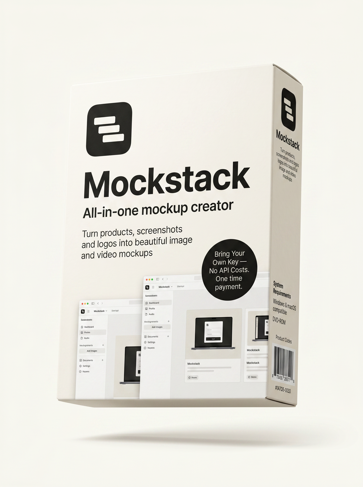

# MockStack



MockStack is a browser-based AI mockup app for logos, screenshots, product photos, and mockup video.

Upload an asset, choose from 1,130 commercial mockup templates, and generate polished outputs through your own fal.ai API key. MockStack is built around a BYOK model: users pay fal.ai directly for generation and MockStack does not mark up image or video usage.

The packaged lifetime version is available at [getmockstack.com](https://getmockstack.com).

## What It Does

- Generates mockups for three input types: logo, screenshot, and product photo
- Includes 1,130 templates: 396 logo, 237 screenshot, 497 product, and 158 video templates
- Uses real generated thumbnails for the full template library
- Supports custom plain-language direction, such as changing shirt color or adding seasonal styling
- Saves recent generations in a browser-local Library
- Can be installed as a desktop-style PWA from Chrome or Edge
- Keeps the fal.ai API key in browser local storage, not on MockStack servers

## How It Works

1. Upload a PNG, JPG, or WebP.
2. Pick one or more templates from the scene library.
3. Optionally add custom direction.
4. Generate through fal.ai.
5. Download results or revisit them from the local Library.

## Run Locally

Requirements:

- Node.js 20+
- npm
- A fal.ai API key for generation

Install dependencies:

```bash
npm install
```

Start the dev server:

```bash
npm run dev
```

Then open the local URL shown in the terminal, usually:

```text
http://127.0.0.1:5173/
```

Build for production:

```bash
npm run build
```

Run lint:

```bash
npm run lint
```

## fal.ai Setup

MockStack uses the official fal.ai client in the browser. Add credits and create an API key from:

- [fal.ai](https://fal.ai)
- [fal.ai API keys](https://fal.ai/dashboard/keys)
- [fal.ai credits](https://fal.ai/dashboard/usage-billing/credits)

Paste the key into MockStack Settings. The key is stored in browser local storage on that device.

## Project Structure

```text
src/
  App.tsx                         Main app, routes, wizard, Help, Library
  data/presets.ts                 Hand-tuned launch preset library
  data/presetExpansionCatalog.ts  1,000-template expansion catalog
  data/expandedPresets.ts         Runtime adapter for expansion templates
public/
  special.html                    Live sales page
  preset-gallery.json             Landing-page template gallery manifest
  preset-thumbnails/              1,130 generated template thumbnails
  mockstack-3d-cover.png          Public README and sales visual
docs/
  README.md                       Documentation index
  product-overview.md             Product scope and positioning
  technical-architecture.md       Architecture notes
  sales-page.md                   Launch page positioning
```

## Documentation

Start with [docs/README.md](docs/README.md).

Key docs:

- [Product Overview](docs/product-overview.md)
- [Technical Architecture](docs/technical-architecture.md)
- [Sales Page And Launch Positioning](docs/sales-page.md)
- [Thumbnail Generation Workflow](docs/thumbnail-generation.md)
- [PWA Install](docs/features/pwa-install.md)
- [Help Center](docs/features/help.md)

## Notes

MockStack is intentionally focused. It is not a full creative suite or agency fulfillment platform. The product boundary is mockup-context generation for logos, screenshots, product photos, and controlled mockup video.

This repo contains the source code. The already packaged version, launch offer, and buyer-facing instructions live at [getmockstack.com](https://getmockstack.com).
